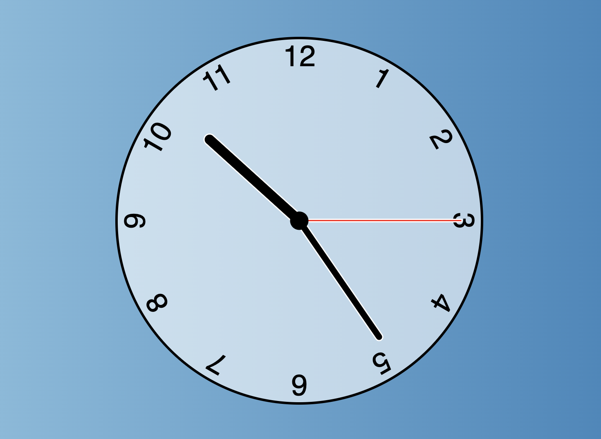

# _javascript-clock

#### By _Joe Roaden_

#### _A Javascript clock with custom styling using the built in Date Object_

---
## Table of Contents
[Technologies Used](#technologies-used)  
[Description](#description)  
[Setup/Installation Requirements](#setup-and-installation-requirements)   
[Known Bugs](#known-bugs)  
[License](#License)

---
## Technologies Used

* _Javascript_
* _HTML_
* _CSS_

---
## Description

_Clock uses the Date object to give accurate time.  Custom styling used to build clock face, hands and numhers. Clone this project to style your own clock_
---
## Setup and Installation Requirements

<strong>Initial Setup</strong>
  

1. Copy the git repository url: https://github.com/joeroaden/javascript-clock
2. Open a shell program and navigate to your desktop.
3. Clone the repository for this project using the `git clone` command and including the copied URL.
4. While still in the shell program, navigate to the root directory of the newly created file named `javascript-clock`.
5. To view the application on your local live server, right click on index.html.

---
## Known Bugs

* _There are no known bugs at this time_

---
## License

[Copyright](/LICENSE) © 2022 Joe Roaden

